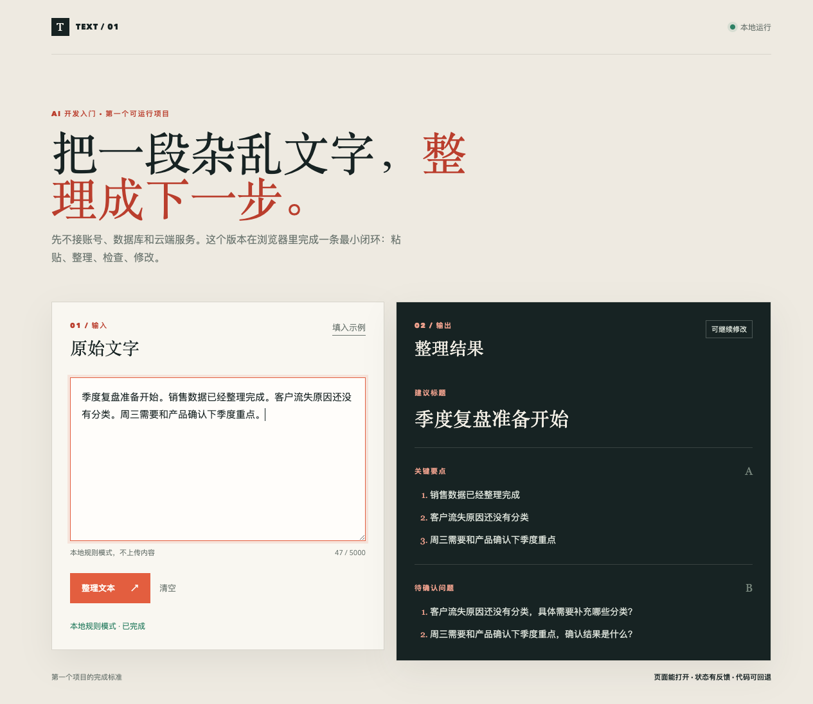
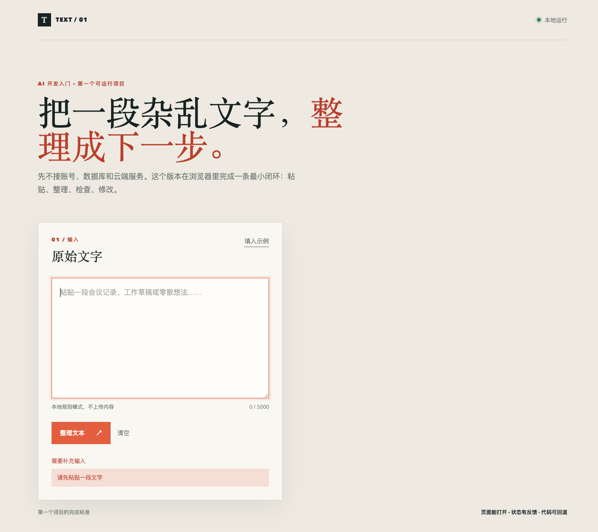

# 本地文本整理器

这是《AI 时代的编程革命：先做出一个能跑的工具》的配套实操项目。

它在浏览器本地完成一条最小闭环：粘贴一段文字，整理出标题、关键要点和待确认问题，再处理空输入和超长输入。

## 快速开始

环境要求：Node.js 22 或兼容的较新版本。

```bash
npm test
npm start
```

打开 `http://127.0.0.1:4173`，即可看到页面。

## 项目结构

```text
public/index.html       页面结构
public/styles.css       页面样式
public/app.js           页面交互
public/organizer.js     本地整理规则
server.js               静态文件服务器
test/organizer.test.js  核心行为测试
practice-log.md         实操记录与已知问题
docs/images/            实测截图
```

## 当前版本做什么

- 使用本地规则整理，不调用在线模型，也不上传输入内容；
- 从文本中提取建议标题、关键要点和待确认问题；
- 对空输入和超过 5000 字的输入给出失败提示；
- 支持清空、重新输入和移动端窄屏布局。

## 当前版本不做什么

- 不包含账号、云端保存、多人协作和自动发布；
- 不代表已经完成大模型调用或模型效果验证；
- 不建议直接用于生产环境。

## 实操记录

完整的环境版本、验证路径、实际输出和一次边界问题修复，见 [`practice-log.md`](./practice-log.md)。文章正文只保留项目目标、效果和边界，想复现实现过程可以直接从这个仓库开始。

## 实测截图






## 后续方向

后续版本可以把 `public/organizer.js` 的本地规则替换为服务端模型调用，但需要新增后端、密钥管理、输出校验、网络失败处理和隐私说明。
